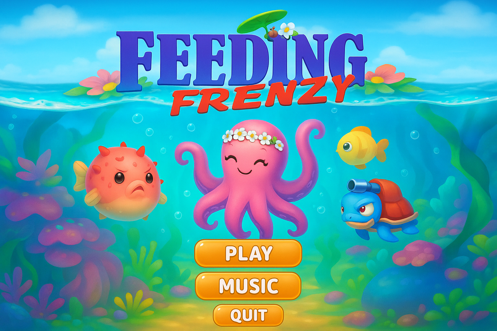
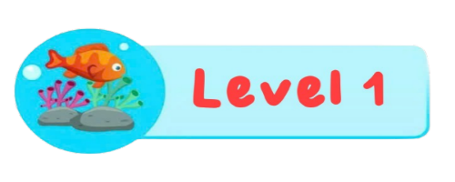

# Game

# 🐟 Feeding Frenzy - Cá lớn nuốt cá bé

<div align="center">
  
</div>

---

## 🎮 Giới thiệu

- **Tác giả: Bùi Thị Hà Thu - 24022737
- **Lớp:** K69I-IS4- Trường Đại học Công Nghệ - ĐHQGHN
- **Môn học:** Lập trình nâng cao
- **Ngôn ngữ:** C++
- **Thư viện:** SDL2 (SDL_image, SDL_ttf, SDL_mixer)

Feeding Frenzy là một game hành động 2D nơi người chơi điều khiển một chú cá con, ăn các cá nhỏ hơn để tăng điểm và kích thước, tránh các cá lớn và đánh bại boss để qua màn.

---

## 🕹️ Điều khiển

| Hành động  | chuột |
|----------|----------------|
| Di chuyển | Kéo bằng chuột trái |
| Dừng lại  | Thả chuột |
| Menu     | Chuột |
| Thoát game | Nút quit trên menu |

---

## 🌟 Gameplay & Tính năng

### 🎯 Mục tiêu
- Ăn cá nhỏ hơn để tăng điểm.
- Né cá lớn hơn để không bị nuốt.
- Khi đạt điểm yêu cầu → xuất hiện boss.
- Nếu đủ điểm, ăn boss để qua màn hoặc thắng.

### ⚙️ Cơ chế
- Cá AI spawn ngẫu nhiên từ trái/phải màn hình mỗi `spawnInterval`.
- Cá AI có nhiều loại (ảnh khác nhau, điểm khác nhau).
- Nếu điểm cá AI ≥ 600 → hệ thống bật cảnh báo cá mập (`pendingShark`).

<div align="center">
  
  
</div>

### 🦈 Boss
- Level 1: Boss là bạch tuộc (100 điểm)
- Level 2: Boss là cá mập (2500 điểm)
- Boss đuổi theo đầu Player (updateBoss(px, py))
- Nếu Player đủ điểm → thắng, cá grow().
- Nếu chưa đủ → thua (Game Over)

### 🫧 Hiệu ứng Bubble
- Khi ăn cá hoặc va chạm boss → tạo 5–9 bubble
- Vị trí random quanh điểm va chạm
- Bay lên, mờ dần → tăng tính trực quan

### 🚨 Cảnh báo cá mập
- Khi cá AI chuẩn bị spawn mà có pointValue ≥ 600 → `pendingShark = true`
- Hiện "WARNING !!!" trong khoảng `warningLife`
- Sau đó mới spawn con shark thật

<div align="center">
  
  
</div>

---

## 🗺️ Cấp độ

| Level | Điểm cần | Boss | Ảnh |
|-------|----------|------|------|
| 1     | 100      | Bạch tuộc nhỏ | `bachtuoc50.png` |
| 2     | 2500     | Cá mập lớn    | `boss1000.png`  |

---

## 📂 Cấu trúc thư mục (ví dụ)

```
assets/
├── cavang20.png
├── camapsmall.png
├── bachtuoc50.png
├── boss1000.png
├── bubble.png
├── warning.png
├── level1Back.png
├── level2Back.png
├── menu.png
├── font.ttf
```

---

## 🛠️ Build & Run

1. Cài đặt SDL2 + SDL_image + SDL_ttf + SDL_mixer
2. Dùng Visual Studio hoặc Makefile để biên dịch
3. Đảm bảo các thư mục hình ảnh/sound đúng
4. Chạy file `main.cpp`

---

## 🏁 Ghi công

- **Lập trình & thiết kế:** Nguyễn Minh Quân (1% của UET)
- **Tài nguyên hình ảnh:** OpenGameArt, tự chỉnh sửa
- **Tham khảo:** LazyFoo SDL Tutorial, thầy cô môn Lập trình nâng cao

---

> 🧠 *“Code là kỹ thuật, nhưng gameplay là cảm xúc.”* – 1% của UET
